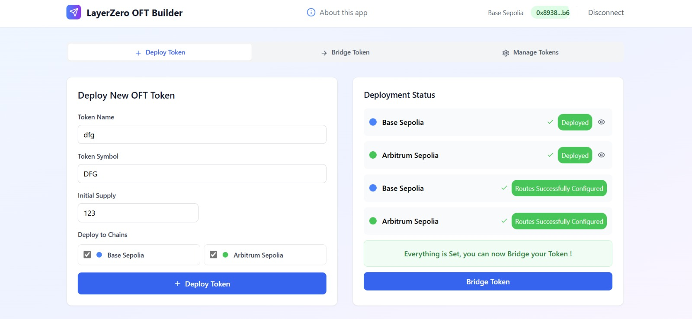
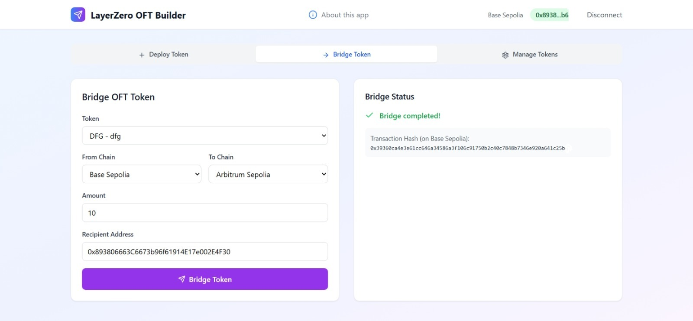

# Overview (Goal)
This project is a React application that implements the LayerZero OFT (Omnichain Fungible Token) functionality. It allows users to connect their wallets, deploy tokens, and bridge tokens across supported chains (TESTNET for the demo).  

**Deterministic Cross-Chain Contract Addressing**  
The DApp uses Solidity's CREATE2 opcode to deploy OFT contracts at the same address on every chain. The address is derived from the bytecode and a fixed salt, which includes currently the token name and symbol. Make sure you use unique identifiers when deploying, because you cannot create two times the same token (same name and symbol) using the same factory (You can also use an other type of salt if you want to avoid this);

Try it here : https://layerzero-dapp.vercel.app/


## React + Vite + TypeScript Template (react-vite-ui)

[](https://github.com/thomasfevre/layerzero_code/blob/main/LICENSE)

> [!NOTE]
> This template uses Tailwind v3, if you want to use Tailwind v4, check the [tw4 branch](https://github.com/dan5py/react-vite-shadcn-ui/tree/tw4).

## 🎉 Stack

- **React** - A JavaScript library for building user interfaces.
- **Vite** - A fast, opinionated frontend build tool.
- **TypeScript** - A typed superset of JavaScript that compiles to plain JavaScript.
- **Tailwind CSS** - A utility-first CSS framework. (`v3`)
- **Tailwind Prettier Plugin** - A Prettier plugin for formatting Tailwind CSS classes.
- **ESLint** - A pluggable linting utility for JavaScript and TypeScript.
- **PostCSS** - A tool for transforming CSS with JavaScript.
- **Autoprefixer** - A PostCSS plugin to parse CSS and add vendor prefixes.
- **Lucide-react** - Beautifully designed components that you can copy and paste into your apps.
- **Wagmi** - A collection of React Hooks for Ethereum, enabling wallet connections, contract interactions, and seamless Web3 integration.

## ⚙️ Prerequisites

Make sure you have the following installed on your development machine:

- Node.js (version 22 or above)
- pnpm (package manager)

## 🚀 Getting Started

Follow these steps to get started with the react-vite-ui template:

1. Clone the repository:

   ```bash
   git clone https://github.com/dan5py/react-vite-ui.git
   ```

2. Navigate to the project directory:

   ```bash
   cd react-vite-ui
   ```

3. Install the dependencies:

   ```bash
   pnpm install
   ```
4. Create a `.env` file:

   Copy the example environment file and update it with your own configuration:

   ```bash
   cp .env.example .env
   ```

   Edit the `.env` file to set the required environment variables (such as API keys, RPC URLs, etc.) according to your setup.

5. Start the development server:

   ```bash
   pnpm dev
   ```

## 📜 Available Scripts

- pnpm dev - Starts the development server.
- pnpm build - Builds the production-ready code.
- pnpm lint - Runs ESLint to analyze and lint the code.
- pnpm preview - Starts the Vite development server in preview mode.

## 📂 Project Structure

The project structure follows a standard React application layout:

<details>
<summary>Project Directory Structure</summary>

```
layerzero_code/
├── public/
├── script-dev/
│   ├── .env
│   └── create_deploy_setup_OFT.js
├── src/
│   ├── App.tsx
│   ├── artifacts/
│   │   ├── factory/
│   │   │   ├── Create2Factory.json
│   │   │   └── Create2Factory.sol
│   │   └── MyOFT/
│   │       ├── MyOFT.json
│   │       └── MyOFT.sol
│   ├── components/
│   │   ├── dialogs/
│   │   │   └── info-dialog.tsx
│   │   ├── LayerZeroOFTApp.tsx
│   │   └── tabs/
│   │       ├── bridge-tab.tsx
│   │       ├── deploy-tab.tsx
│   │       └── manage-tab.tsx
│   ├── hooks/
│   │   └── usePeerConfiguration.ts
│   ├── lib/
│   │   ├── constants.ts
│   │   ├── types.ts
│   │   └── utils.ts
│   ├── main.tsx
│   ├── styles/
│   │   └── globals.css
│   └── vite-env.d.ts
├── .env
├── .env.exemple
├── .gitignore
├── components.json
├── eslint.config.js
├── index.html
├── LICENSE
├── package-lock.json
├── package.json
├── pnpm-lock.yaml
├── pnpm-workspace.yaml
├── postcss.config.js
├── README.md
├── tailwind.config.ts
├── tsconfig.app.json
├── tsconfig.json
├── tsconfig.node.json
└── vite.config.ts
```
</details>

## Screenshots

| Deploy Tab | Bridge Tab |
|------------|------------|
|  |  |


## 📄 License

This project is licensed under the MIT License. See the [LICENSE](https://choosealicense.com/licenses/mit/) file for details.
